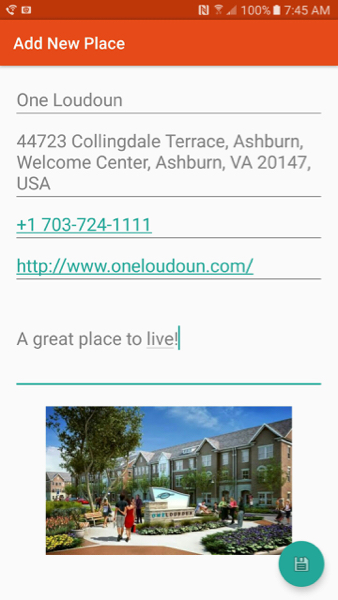
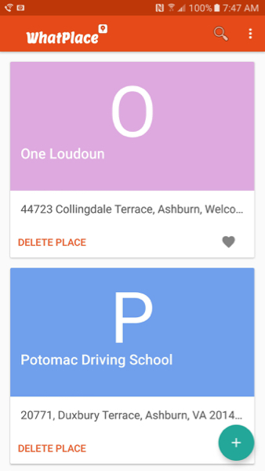
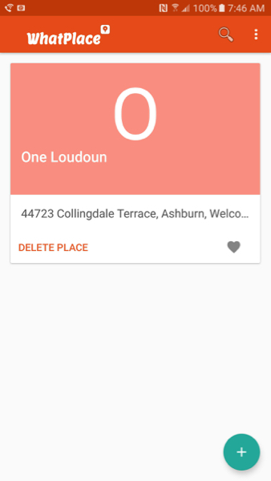

# WhatPlace Material Design App for Android Udacity Nanodegree

This is a Material Design app developed as Capstone Project for Udacity's Android Nanodegree program. 
WhatPlace uses Google Place API under the hood to search for neaby and add it as a card view list.

### Screenshots

----

-----

-----
